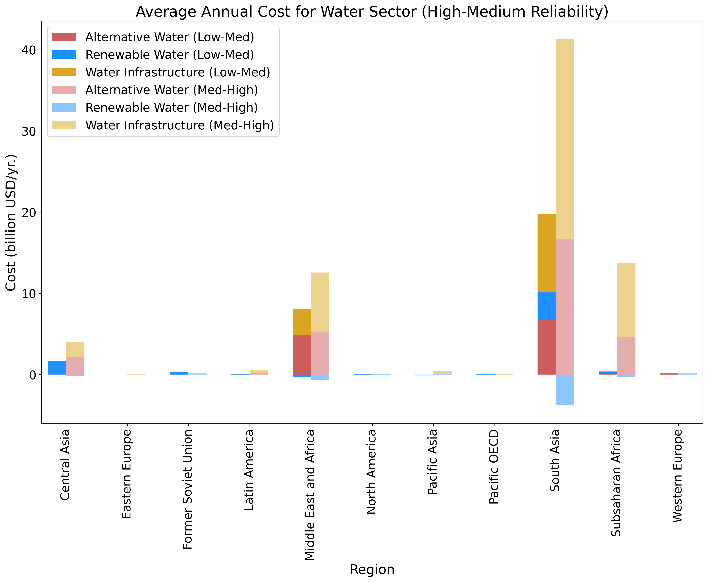

# Visualize-Mastery

## Starting a new notebook

1- Stacked and Simple Bar Chart Visualization

- The visualization presents a combination of stacked and simple bar charts representing the average annual cost for the water sector under different reliability levels across various regions.
- The bars are categorized into two groups: 'Low-Med' and 'Med-High', indicated by full color and semi-transparent bars respectively.
- Each group consists of three different components represented by different colors ('indianred', 'dodgerblue', and 'goldenrod'). These components signify different aspects within the water sector.
- The regions are listed along the x-axis, while the y-axis represents the cost in billions USD per year.
- This way of visualization enables a clear comparison of the costs across different regions and reliability levels.
- The stacked bars allow us to understand the distribution of different components within each reliability level for a particular region.

You can find the Python notebook that generates this visualization here: [Notebook link](./Notebooks/Combo of Simple and Stacked bar plot.ipynb)

